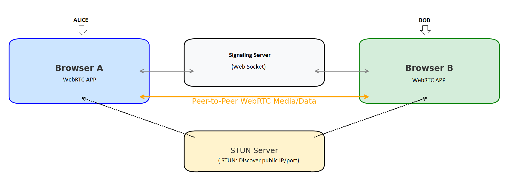

# A simple WebRTC Video Chat 

This application allows two users to connect via video using WebRTC. Each user registers with a name, and they can call another user by entering their name in the UI.

## Features

- Peer-to-peer WebRTC connection
- Bootstrap UI
- Secure WebSocket signaling (WSS)
- STUN server support
- Named user registration (e.g., "alice", "bob")

---

## Setup Instructions

### 1. Install Coturn (STUN/TURN)

```bash
sudo apt update && sudo apt install coturn
sudo nano /etc/turnserver.conf
```

Add:
```
listening-port=3478
fingerprint
lt-cred-mech
realm=yourdomain.com
user=webrtc:password
```

Then:
```bash
sudo systemctl enable coturn
sudo systemctl start coturn
```

### Setup NGINX (WSS Reverse Proxy)

```nginx
server {
    listen 443 ssl;
    server_name yourdomain.com;

    ssl_certificate /etc/letsencrypt/live/yourdomain.com/fullchain.pem;
    ssl_certificate_key /etc/letsencrypt/live/yourdomain.com/privkey.pem;

    location / {
        root /var/www/html;
        index index.html;
    }

    location /ws {
        proxy_pass https://localhost:443;
        proxy_http_version 1.1;
        proxy_set_header Upgrade $http_upgrade;
        proxy_set_header Connection "upgrade";
        proxy_set_header Host $host;
    }
}
```

Restart NGINX:
```bash
sudo systemctl restart nginx
```

### 3. Run the Signaling Server

```bash
node server.js
```

---

## Use Case Example

### User 1 (Alice):
- Opens the app at https://localhost:443
- Enters `alice` as name
- Sees: **Your ID: alice**
- Invite, via email,  `Bob` by sending him the url `https://localhost:443` and to call `alice` peer)

### User 2 (Bob):
- Opens the app
- Enters `bob` as name
- Enters `alice` in "Enter peer name to call"
- Clicks **Call**

Video call starts.

---

The diagram below describes a canonical communication flow



| Component        | Role                              | Technology Example   |
|------------------|-----------------------------------|-----------------------|
| STUN server      | NAT traversal                     | Coturn (`stun:` URL) |
| Signaling server | Exchange session info             | WebSocket, HTTP       |
| WebRTC           | Real-time peer-to-peer media/data | Built into browser    |

