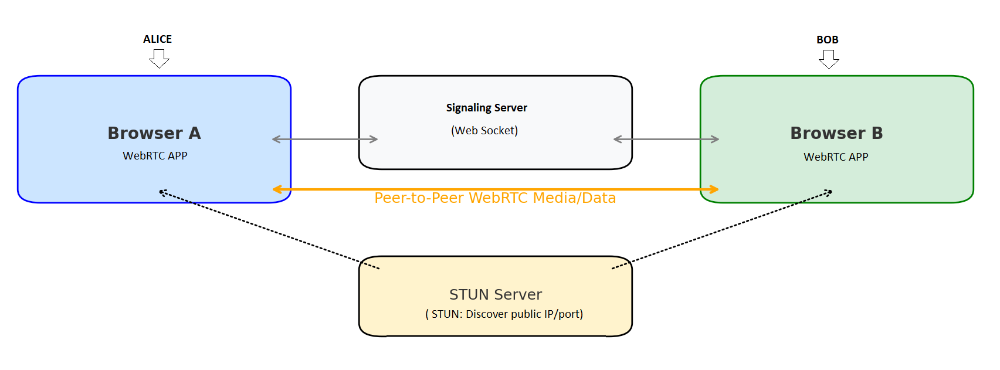

# WebRTC: Real-Time Communication in the Browser

**WebRTC (Web Real-Time Communication)** is a powerful technology that allows browsers and mobile apps (clients or peers)  to communicate directly via audio, video, and data — without the need for plugins or external software.

Key Components of WebRTC are:

### 1. **STUN Server (Session Traversal Utilities for NAT)**
- Purpose: Helps each peer discover their **public IP address** when they are behind a NAT (router).
- Role: Allows peer-to-peer (P2P) communication by telling each client what their public-facing IP and port are.
- Common STUN server: Coturn (open-source)

### 2. **Signaling Server**
- Purpose: Allows peers to exchange connection details like:
  - Session Description Protocol (SDP) offers and answers
  - ICE candidates (IP/port discovery info)
- Note: **WebRTC does not define signaling**, so you can use WebSocket, HTTP, or any custom protocol.

---

## Communication Flow
The diagram below describes a canonical communication flow

---

### Real-World Analogy

Imagine two people Alice and Bob (peers) trying to have a phone call:

- **STUN server** tells them their "phone numbers" (public IP).
- **Signaling server** helps them exchange those phone numbers and set up the call.
- Once set up, the call happens **directly between the two phones** — not through the switchboard.

## Summary

| Component        | Role                              | Technology Example   |
|------------------|-----------------------------------|-----------------------|
| STUN server      | NAT traversal                     | Coturn (`stun:` URL) |
| Signaling server | Exchange session info             | WebSocket, HTTP       |
| WebRTC           | Real-time peer-to-peer media/data | Built into browser    |

WebRTC handles media transport — but **you must implement signaling** and provide a **STUN server** to make it work reliably over the internet.

